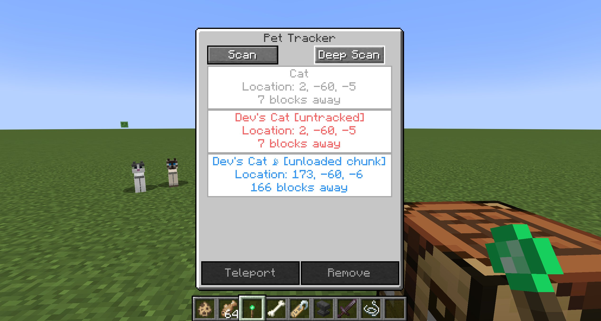

# 🐾 PetTracker

this is a port with some upgrades 
it was originally made by https://github.com/justinwon777
https://github.com/justinwon777/PetTracker/

**PetTracker** is a Minecraft Forge mod for **1.20.1** that lets you track your tamed pets with a special item. Ideal for players who frequently lose their cats, dogs, or other tameable companions.

WIP (im currently 2025.05.22 still working on it 24/7)
---

## 📦 Features

- 🧭 Adds a Pet Tracker item that lists your tamed pets
- 📍 Shows pet names, positions, and real-time distance
- 🐺 Supports any TamableAnimal (wolves, cats, parrots, foxes, etc.)
- 🔄 Automatically updates tracked pets while the item is in your inventory
- 🧭 Scan nearby pets (in loaded chunks)
- 🛰️ Deep scan (singleplayer only) for all tamed pets in the current dimension, including those in unloaded chunks
- ✅ Simple UI for teleporting to or removing pets from the list
- 🎨 Visual distinction for globally scanned pets not currently rendered in client view




---

## 🛠 Requirements

- Minecraft **1.20.1**
- Forge **47.2.0** or higher

---

## 🚀 Installation

1. Install Minecraft Forge 1.20.1 from [https://files.minecraftforge.net/](https://files.minecraftforge.net/)
2. Download the mod JAR file below
3. Place the `.jar` file in your `mods/` folder
4. Launch the game!

[Download PetTracker v1.0.1](https://github.com/jaxx0rr/PetTracker/releases/download/v1.0.2/pettracker-1.0.1-1.20.2.jar)
---

## 🔧 Building the mod

To build the mod from source:

```bash
./gradlew build
