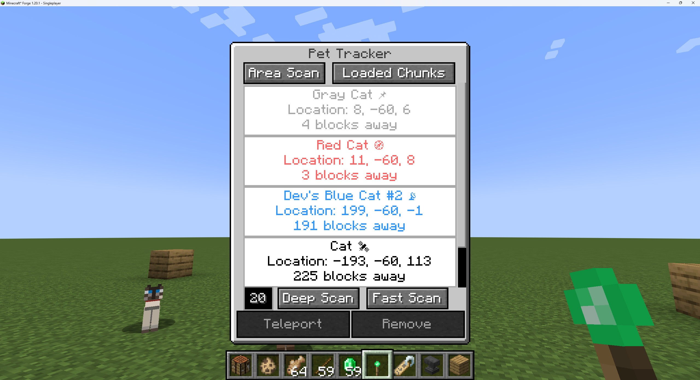

# 🐾 Pet Tracker for 1.20.1

this is a port of https://github.com/justinwon777/PetTracker/

the original did not have any of the scan features

**PetTracker** is a Minecraft Forge mod for **1.20.1** that lets you track your tamed pets with a special item. Ideal for players who frequently lose their cats, dogs, or other tameable companions.

---

## 📦 Features

- 🧭 Adds a Pet Tracker item that lists your tamed pets
- 📍 Shows pet names, positions, and real-time distance
- 🐺 Supports any TamableAnimal (wolves, cats, parrots, foxes, etc.) even pets from mods.
- 🔄 Automatically updates tracked pets while the item is in your inventory (and chunk is loaded)
- 🧭 Scan nearby pets (in loaded chunks)
- 🛰️ Deep scan (in a radius) for all tamed pets in the current dimension in unloaded chunks
- ✅ Simple UI for teleporting/to or removing pets from the list
- 🎨 Visual distinction for globally scanned pets not currently rendered in client view
- 🌐 Works in Singleplayer and Multiplayer (if the mod is loaded on the server)
- 🌀 Supports other dimensions including custom.
- 🐕‍🦺 Teleport tracked pets to you and teleport yourself to tracked pets in any dimension.
- ✨Teleports your non-sitting pets with you when you teleport - you can use this as a fast travel system.

---

---

## 🧪 How to Use

1. **Craft the Pet Tracker:** place an emerald over a stick in the crafting grid.
2. **Right-click a pet** to manually add it to the tracker. These will appear in **gray**.
3. Use the in-game buttons:
   - **[Area Scan]** to add all nearby pets (owned and unowned). These will show in **red** 🔴.
   - **[Loaded Chunks]** to include all pets from currently loaded chunks. These appear in **blue** 🔵.
   - **[Deep Scan]** to include pets from unloaded chunks in a radius. Slow, but no server lag (can cause chunk generation). **Black icons** ⚫.
   - **[Fast Scan]** does the same as Deep Scan, but it's much faster and more demanding on the server. Also **Black icons** ⚫.

---

## 🛠 Requirements

- Minecraft **1.20.1**
- Forge **47.2.0** or higher

---

## 🚀 Installation

1. Install Minecraft Forge 1.20.1 from [https://files.minecraftforge.net/](https://files.minecraftforge.net/)
2. Download the mod JAR file below
3. Place the `.jar` file in your `mods/` folder
4. Launch the game!

[Download PetTracker v1.0.3](https://github.com/jaxx0rr/PetTracker/releases/download/1.0.3/pettracker-1.0.3-1.20.1.jar)
---
